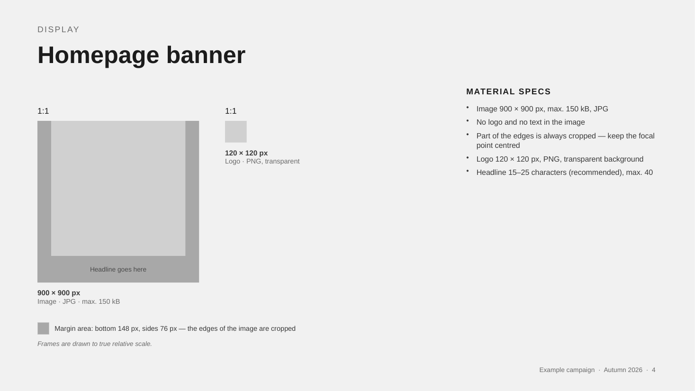

# specs-to-slides

A Claude skill that turns media agency material specifications into a production spec deck — a PowerPoint where **every deliverable is one aspect-ratio placeholder frame plus its technical rules**.

Built for a workflow that ends in Canva: import the deck, drop finished artwork onto the frames, done.



## What it does

You drop the spec files from the media agency into a folder — spreadsheets, PDFs, whatever they sent — and ask for a production deck. The skill:

1. **Extracts** every spec, including the ones that hide in places a normal read misses: character limits stored as conditional formatting, colour pickers stored as data-validation lists, specs that appear only in the template file and not the instruction PDF.
2. **Consolidates** line items into deliverables. Two TV sales houses with identical `.mxf` specs are one slide and one master file, not two of each. 23 spreadsheet rows routinely become 12 things a designer actually makes.
3. **Cross-checks** the specs and reports what is wrong: deadlines already passed, frame rates that conflict between channels sharing one creative, delivered assets whose real pixel dimensions do not match their filename, character limits already exceeded by copy in the template, requirements that are technically obsolete.

   Findings are reported, never silently fixed — and never used to fill a blank in the spec.
4. **Builds** the deck and runs visual QA on every rendered slide.

## Nothing enters the deck that is not in the source

A format on a slide will be produced and billed, so every frame has to trace to a line item in the spec sheet. The skill will not add a "standard" size the platform supports, will not fill a blank spec field from general knowledge, and will not present platform best practice as a client requirement. Gaps and blanks go on the findings slide as questions.

Before building, it shows you which source rows each slide came from.

## The frame rule

Frames are drawn to **true relative scale within a row**, not just true aspect ratio. A 120 × 120 logo next to a 900 × 900 banner is genuinely tiny. A 310 × 446 mobile banner is genuinely half of a 620 × 891 desktop one.

This is the detail that makes the deck useful rather than decorative, and it is the thing most likely to get "fixed" by someone tidying up the code. Don't.

## Install

**Claude Code / Cowork**

```bash
git clone https://github.com/eemeli-r/specs-to-slides.git ~/.claude/skills/specs-to-slides
```

Or drop the packaged `specs-to-slides.skill` file into a Cowork session and press Save skill.

**Dependencies**

| Tool | Needed for | Install |
|---|---|---|
| Node + `pptxgenjs` | Building the deck | `npm install pptxgenjs` |
| Python 3 | Spec extraction | stdlib only; Pillow optional for exotic image formats |
| `pdftotext` | PDF specs | `brew install poppler` / `apt install poppler-utils` |
| LibreOffice | Visual QA rendering | `brew install --cask libreoffice` |

The extractor deliberately avoids openpyxl and pandas so it runs in sandboxes where those are unavailable.

## Use

Ask in plain language:

> Make a production deck from these spec files

> Check these specs before we start production

Or drive the generator directly:

```bash
python3 scripts/extract_specs.py ./spec-files/    # read everything
node scripts/build_deck.js deck.json "Output.pptx"
```

## Language

The deck is written in English. Source material often is not — media agency spec sheets frequently arrive in another language. Spec text is translated into English for the deck, while technical tokens (`1080 × 1920 px`, `.mxf`, `−23 LUFS`, `CMYK`) and identifiers such as filenames, order numbers and publication names are kept exactly as the agency sent them.

## Layout

```
specs-to-slides/
├─ SKILL.md                    workflow, design system, Canva constraints
├─ scripts/
│  ├─ extract_specs.py         xlsx (all sheets + dropdowns + cond. formatting
│  │                           + fill colours), pdf, real image dimensions
│  └─ build_deck.js            JSON config → pptx
├─ references/
│  ├─ layout.md                grid, slide types, the three recurring defects
│  ├─ consolidation.md         what to merge, what to keep separate
│  ├─ crosscheck.md            the audit checklist
│  └─ deck-schema.md           full JSON schema
└─ assets/
   └─ example-deck.json        working 8-slide example, exercises everything
```

## Configuring

Font and colours live in `theme` in the deck config:

```json
"theme": { "font": "Arial" }
```

Arial is the default because it ships with every Office install, exists in Canva, and renders at identical widths in LibreOffice — so the QA preview tells the truth about text overflow. A font that is not installed locally will substitute in PowerPoint and may substitute again on Canva import.

The palette is **neutral greys and white on purpose**. The deck carries no brand of its own; the artwork dropped onto it does, and the same template is used across clients. The three frame greys are ordered by meaning — darker is more covered, lighter is more yours:

| | | |
|---|---|---|
| `A8A8A8` | `frameDark` | crops away, or gets an overlay |
| `D0D0D0` | `frame` | the artwork area |
| `FFFFFF` | `safe` | where text and logos can live |

Overriding a colour is supported for a one-off, but the default should stay neutral.

## Notes

Every slide gets speaker notes carrying the reasoning that does not fit on the slide: why two formats were merged, what a rule protects against, which spec was blank in the source. They survive Canva import and are where the audit trail lives.

## Licence

MIT
